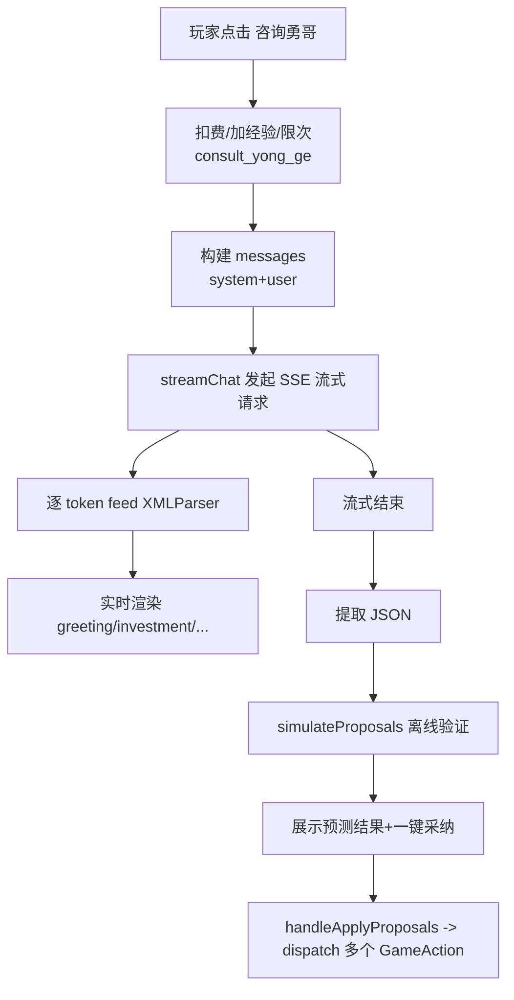

# 赛博勇哥（勇哥建议系统）实现原理：从规则提醒到 LLM 连麦诊断

本文档聚焦“勇哥建议系统”的两条链路：

1. **规则库提醒（YongGeAdvicePanel）**：不依赖 LLM，基于游戏状态触发预置的“勇哥提醒”。
2. **LLM 连麦诊断（CyberYongGe）**：把当前经营数据序列化后发给 LLM，要求按 XML 流式输出分段诊断，并给出可执行的 JSON 操作提案；前端实时渲染、离线模拟验证，然后可一键应用到游戏引擎。

---

## 1. 系统入口与文件地图

### 1.1 UI 入口（玩家如何看到勇哥）

- **顶部按钮 “咨询勇哥”**：由 [GameHeader.tsx](src/components/GameHeader.tsx) 触发 `onOpenCyberYongGe`，最终在 [App.tsx](src/App.tsx) 打开侧边栏面板。
- **每周总结弹窗 “让勇哥看看”**：由 [WeeklySummaryDialog.tsx](src/components/WeeklySummaryDialog.tsx) 触发同一个打开逻辑。

### 1.2 两套“建议”的 UI 组件

- **规则库提醒面板**： [YongGeAdvicePanel.tsx](src/components/YongGeAdvicePanel.tsx)
- **LLM 连麦诊断面板（侧边栏）**： [CyberYongGe.tsx](src/components/CyberYongGe.tsx)

### 1.3 LLM 子模块（前端直连）

都在 `src/lib/llm/`：

- **请求客户端（SSE 流式）**： [client.ts](src/lib/llm/client.ts)
- **System Prompt + 状态序列化**： [prompts.ts](src/lib/llm/prompts.ts)
- **流式 XML 增量解析**： [xmlParser.ts](src/lib/llm/xmlParser.ts)
- **提案验证模拟器（离线预测）**： [simulator.ts](src/lib/llm/simulator.ts)

### 1.4 与游戏引擎的衔接点

- **“咨询勇哥”动作在引擎里的扣费/加经验/限次**： [gameActions.ts](src/lib/gameActions.ts) 的 `handleConsultYongGe`
- **“一键采纳提案”把提案映射成实际 GameAction**： [App.tsx](src/App.tsx) 的 `handleApplyProposals`

---

## 2. 规则库提醒（非 LLM）：YongGeAdvicePanel

这条链路的特点是：

- **零网络、零随机性**：完全由本地状态决定。
- **触发条件是一组“命名规则”而非表达式 DSL**：每条建议绑定一个 `triggerCondition` 字符串，组件用 `switch` 判断。

### 2.1 数据来源：yongGeAdvices

勇哥提醒库定义在 [gameData.ts](src/data/gameData.ts)：

- `export const yongGeAdvices: YongGeAdvice[] = [...]`
- 每条包含：`id/title/content/triggerCondition/severity`

类型定义在 [game.ts](src/types/game.ts) 的 `export interface YongGeAdvice`.

### 2.2 触发器实现：evaluateTriggerCondition

逻辑在 [YongGeAdvicePanel.tsx](src/components/YongGeAdvicePanel.tsx)：

- `selectedHighRiskBrand`：`selectedBrand.isQuickFranchise === true`
- `badLocation`：区位是 `school/office` 但选品里缺少对应高吸引产品（`appeal.students/office > 70`）
- `overStaff`：员工数 > 6
- `singleProduct`：只选了 1 个产品
- `lowMargin`：平均毛利率 < 0.3（基于 `baseCost/basePrice`）
- `competeWithGiant`：周边直接竞品店铺 >= 3（用 `nearbyShops` + 类目匹配）
- `unsaveable`：现金 < 0 且连续盈利为 0

渲染策略：

- 先 `filter` 出触发的建议集合，再按严重级别展示不同颜色（critical 红、warning 橙）。

这套系统和 LLM 无耦合；它本质上是“剧情/教学式提醒”，偏向确定性叙事。

---

## 3. LLM 连麦诊断（核心）：CyberYongGe 端到端链路

这条链路的目标是把**经营数据 → 人设诊断文本（强沉浸）→ 可执行提案（结构化）**串起来，并尽可能降低 LLM“胡说八道导致误操作”的风险。

整体流程可以概括为：



下面按模块拆开说明。

---

## 4. “咨询勇哥”的游戏内成本与限制

### 4.1 引擎层：consult_yong_ge Action

游戏引擎在 [gameActions.ts](src/lib/gameActions.ts) 的 `handleConsultYongGe` 做三件事：

1. **限次**：`consultYongGeThisWeek` 达到 `PASSIVE_EXP_CONFIG.consultYongGeWeeklyLimit` 则失败
2. **扣钱**：现金不足 `PASSIVE_EXP_CONFIG.consultYongGeCost` 则失败；成功则 `cash -= cost`
3. **加经验与升级**：
   - `cognition.exp += consultYongGeExp`
   - `cognition.totalExp += consultYongGeExp`
   - `while` 循环检查升级，更新 `level/expToNext`

配置在 [cognitionData.ts](src/data/cognitionData.ts) 的 `PASSIVE_EXP_CONFIG`：

- `consultYongGeCost = 2000`
- `consultYongGeWeeklyLimit = 2`
- `consultYongGeExp = 40`

### 4.2 UI 层：onConsult 返回 boolean

[CyberYongGe.tsx](src/components/CyberYongGe.tsx) 不直接 dispatch action，而是通过 props `onConsult: () => boolean`：

- 成功：开始流式诊断
- 失败：直接进入 error 状态，提示“余额不足或本周咨询次数已满”

注意：面板标题上写了 `+80认知经验`（见 [CyberYongGe.tsx](src/components/CyberYongGe.tsx) 的 SheetDescription），但引擎配置当前是 `consultYongGeExp = 40`。这意味着 UI 文案与真实数值存在不一致。

---

## 5. Prompt 设计：把 LLM“锁进轨道”

LLM 的关键不是“让模型会算账”，而是让它**以勇哥口吻输出、按固定结构输出、并给出能落地的操作建议**。

这在 [prompts.ts](src/lib/llm/prompts.ts) 里由两部分实现：

1. `YONGGE_SYSTEM_PROMPT`：人设 + 输出协议（XML + proposals JSON）+ 约束
2. `serializeGameState(...)`：把内部状态翻译成“老板能听懂的大白话输入”

### 5.1 System Prompt 的结构

`YONGGE_SYSTEM_PROMPT` 强制模型按如下 XML 标签输出（每个标签对应 UI 上的一张卡片）：

- `<greeting>`：问好与开场
- `<investment>`：追问投资与点评
- `<brand>`：核实品牌/快招风险
- `<surroundings>`：360°转一圈看环境
- `<accounting>`：算账（要求以“我给你算笔账”开头）
- `<conclusion>`：结论与建议
- `<proposals>`：只允许输出 JSON 数组（最多 3 项），作为可执行操作

`<proposals>` 的“操作类型白名单”与参数约束被写得非常具体（例如 `set_price` 只能对已选产品、`join_platform` 只能在平台枚举内等）。这会显著降低“模型发明新操作”的概率。

此外，Prompt 还包含一段非常重要的“沉浸感要求”：禁止模型输出诸如“曝光度系数”“季节修正”等游戏/模型术语，要求把数字改成口语化约数。

这段约束与序列化输入相互配合，属于典型的“**输入侧去技术化 + 输出侧强结构化**”的 LLM 产品化套路。

### 5.2 状态序列化：serializeGameState 的关键点

`serializeGameState(gameState, currentStats, supplyDemandResult)` 生成一段多段落文本，作为 user message 的主体。

它的核心策略是：**尽量给模型足够的决策信息，但用真实世界语言包装，并且在 proposals 所需的地方提供“隐藏的对照表”**。

下面按段说明序列化内容（见 [prompts.ts](src/lib/llm/prompts.ts)）：

#### 5.2.1 基础信息

- 阶段：筹备/经营第几周 + 季节（中文名映射 `SEASON_NAMES`）
- 认知等级不会直接给数字，而是映射为自然语言描述（新手/摸索/老江湖）

#### 5.2.2 品牌信息

- 品牌名、加盟/自主
- 若 `isQuickFranchise` 则写入显式警告文本（⚠️）
- 加盟费与抽成率（这是财务“坑点”的强信号）

#### 5.2.3 选址信息：把修正系数翻译成人流话术

内部 `trafficModifier` 是一个系数，但序列化时不会直接暴露数值，而是分桶为：

- “人流量很旺 / 还不错 / 一般 / 偏少 / 很差”

并输出月租金估算（约数）。

#### 5.2.4 选品信息：给模型“提案可引用”的 ID 映射

每个产品输出：

- 售价（允许自定义价格 `productPrices`）
- 成本（baseCost）
- 毛利率（直接算好给模型）

然后额外附加一行：

> （产品ID映射，仅供proposals使用：奶茶=milktea，…）

这是为了让 `<proposals>` 能输出合法的 `productId`，同时又尽量避免模型在诊断文本里提到“产品ID”这种破沉浸的词。

#### 5.2.5 员工信息：同时给 index 与 id

对每个员工输出一行：

- `[i]`：在列表里的序号（用于 `fire_staff.params.index`）
- `id:`：员工唯一 ID（更稳，用于 `fire_staff.params.staffId`）
- 还输出士气/疲劳的自然语言描述，避免暴露原始数值

这为“解雇某个员工”的提案提供了两种定位方式，并允许 UI 端优先用 `staffId` 做精确匹配（见后文）。

#### 5.2.6 财务数据：把模型需要的数字喂齐

如果在经营阶段，会提供：

- 本周收入/变动成本/固定成本/利润（整数）
- 固定成本分解（租金/工资/水电/营销/折旧）
- 毛利率、盈亏平衡点（周口径）
- 连续盈利用自然语言描述（避免暴露“胜利条件”）
- 累计利润与近几周利润序列

这段是模型能否“像勇哥一样算账”的关键上下文。

#### 5.2.7 经营指标（曝光/口碑/履约）

曝光与口碑仍然是“分桶描述”输出；库存满足率 `lastWeekFulfillment` 也被翻译为“缺货频率”。

#### 5.2.8 外卖与竞争态势（供需模型结果的“去技术化摘要”）

- 外卖：平台数量、评分分桶、周外卖收入/佣金约数
- 竞争：活跃店铺数、直接竞品数
- 供需：使用 `supplyDemandResult.demand.totalDemand` 与 `supply.totalSupply` 计算 ratio 后分桶描述“供过于求/供需平衡/需求旺盛…”
  - 同时输出堂食/外卖收入约数
  - 以及 `overallBottleneck.description` 作为“短板”

注意：这里虽然内部用了供需模型的精确结果，但输入给 LLM 的仍然是“经营语言”，防止模型复述“总需求 284 份”这种破沉浸表达。

### 5.3 buildMessages：最终 messages 形态

`buildMessages(...)` 返回：

- system：`YONGGE_SYSTEM_PROMPT`
- user：`以下是我的餐饮店经营数据...` + `serializeGameState(...)` 文本

返回类型是 `{ role: 'system' | 'user'; content: string }[]`（见 [prompts.ts](src/lib/llm/prompts.ts)）。

---

## 6. 网络层：OpenAI 兼容 SSE 流式客户端（streamChat）

实现见 [client.ts](src/lib/llm/client.ts)。它假设后端提供 **OpenAI Chat Completions 兼容接口**，并启用 `stream: true`。

### 6.1 关键环境变量

服务端通过 `process.env` 读取（无 `VITE_` 前缀，不会暴露到前端）：

- `LLM_API_KEY`
- `LLM_MODEL`（默认 `kimi-k2-turbo-preview`）
- `LLM_BASE_URL`

示例见 [.env.example](.env.example)。

架构说明：

- 前端通过 BFF 代理（`/api/llm/chat/completions`）调用 LLM，API Key 仅存在于服务端。
- 开发模式由 Vite 插件（`src/vite-plugins/llmProxy.ts`）处理代理，生产模式由 `server.mjs` 处理。
- URL 规范化和密钥注入均在服务端完成，前端代码中不包含任何密钥信息。

### 6.2 baseUrl 规范化：normalizeChatCompletionsUrl

`normalizeChatCompletionsUrl(raw)` 会把各种可能的 baseUrl 补成最终的 `.../chat/completions`：

- 未配置：默认 `https://generativelanguage.googleapis.com/v1beta/openai/chat/completions`
- 传入带 `/openai`、`/v1beta`、`/v1` 的路径会做相应拼接

这允许用同一套客户端对接：

- OpenAI / Moonshot / Gemini 的 OpenAI-compatible gateway
- 或自建的 OpenAI 兼容代理

### 6.3 请求体与鉴权

`fetch(baseUrl, { method: 'POST', headers, body })`：

- `Authorization: Bearer ${apiKey}`
- body:
  - `model`
  - `messages`
  - `stream: true`

如果 `response.ok` 为 false，会读出 `response.text()` 并抛出 `LLMError(status, detail)`。

### 6.4 SSE 读取：readSSEStream 的增量拼接方式

`readSSEStream`：

- `response.body.getReader()` 按 chunk 读取
- 用 `TextDecoder` 解码到字符串
- 以 `\n` 分行
- 只处理 `data: ` 开头的行：
  - `data: [DONE]` → 结束
  - 否则 `JSON.parse(data)` 并读取 `parsed.choices[0].delta.content`

它有两个输出通道：

- `fullContent`：拼接所有 delta，最终返回整段内容
- `onChunk(delta)`：每次拿到 delta 立即回调给 UI（用于实时渲染）

---

## 7. 流式 XML 渲染：StreamingXMLParser

实现见 [xmlParser.ts](src/lib/llm/xmlParser.ts)。

### 7.1 设计目标

- LLM 是 token 流式输出的，UI 希望“边出字边显示”；
- 同时 UI 想按 `<greeting>...</greeting>` 这样的段落拆分成步骤卡片；
- 因此需要一个“可增量 feed”的解析器。

### 7.2 实现方式（非常朴素但有效）

`StreamingXMLParser` 的状态只有一个字符串 `buffer`：

- `feed(chunk)`：把新 token 追加到 buffer
- `getSections()`：
  - 对每个 tag（固定列表 `DIAGNOSIS_TAGS`）：
    - 找 `<tag>` 的 `indexOf`
    - 若找到，再找 `</tag>`：
      - 找到：截取中间内容并 `trim()`，标记 `isComplete: true`
      - 未找到：从 `<tag>` 之后截取到 buffer 末尾，标记 `isComplete: false`

### 7.3 关键限制（理解这些很重要）

这种解析器的假设/限制包括：

- **不支持同一 tag 多次出现**：如果模型输出两个 `<accounting>`，这里只会取第一个开标签后的内容到第一个闭标签（或到末尾）。
- **不处理嵌套与属性**：必须严格是 `<tag>` / `</tag>` 这种形式。
- **不保证输出顺序**：`getSections()` 按固定 tag 列表顺序返回，不是按模型实际生成顺序。
- **性能是 O(Tags * bufferLength)**：每次渲染都对整个 buffer 做多次 `indexOf`，文本很长时会变慢；不过诊断段落一般不大，可接受。

这些限制之所以能接受，是因为 Prompt 已经强约束了输出结构，实际输出非常规整。

---

## 8. CyberYongGe UI 状态机：从“流式”到“验证”

主组件见 [CyberYongGe.tsx](src/components/CyberYongGe.tsx)。

### 8.1 关键状态

- `phase: 'idle' | 'streaming' | 'verifying' | 'done' | 'error'`
- `sections: DiagnosisSection[]`：由 XMLParser 生成，实时更新
- `proposals: Proposal[]`：从 `<proposals>` 提取 JSON 后得到
- `simResult: SimulationResult | null`：离线验证结果
- `abortRef: AbortController | null`：用于关闭面板时中止 fetch

### 8.2 流程细节：startDiagnosis

`startDiagnosis` 的逻辑可分为 6 段：

1. 调用 `onConsult()`（扣钱/加经验/限次）
2. 清空 UI 状态，`parser.reset()`，进入 `streaming`
3. `buildMessages(...)` 构建 messages
4. `streamChat({ onChunk })`：
   - 每次 chunk：`parser.feed(chunk)` → `setSections(parser.getSections())`
5. 流式结束后：
   - `finalSections = parser.getSections()`
   - 找到 `tag === 'proposals'` 的 section
   - 用正则 `/\[[\s\S]*\]/` 抓出 JSON 数组片段，再 `JSON.parse`
   - parse 失败则忽略（proposals 为空）
6. 若 proposals 非空：
   - `phase = verifying`
   - `simulateProposals(...)` 得到预测结果，展示验证卡片
   - 最终 `phase = done`

### 8.3 中止机制：关闭面板即 abort

组件有一个 `useEffect`：

- 当 `open` 变为 false 且 `abortRef.current` 存在，就调用 `abort()`

这会使 fetch 抛出 `AbortError`，被 catch 分支识别并直接 return，避免污染错误提示。

---

## 9. 结构化提案（proposals）：从 LLM 输出到落地执行

提案类型定义在 [prompts.ts](src/lib/llm/prompts.ts)：

```ts
export interface Proposal {
  type: 'fire_staff' | 'set_price' | 'start_marketing' | 'stop_marketing'
    | 'join_platform' | 'leave_platform' | 'change_restock' | 'hire_staff';
  params: Record<string, string | number>;
  label: string;
}
```

核心思想是：**LLM 负责生成“操作建议”，但操作本身必须落在一组白名单动作上**。

### 9.1 提案抽取为什么用正则抓 JSON 数组

虽然 prompt 要求 `<proposals>` “只输出 JSON 数组，不要有其他文字”，但实际大模型偶尔会：

- 在数组前后多吐一点解释
- 数组里出现换行/多余空格

因此 UI 端做了一个容错：

- `proposalSection.content.match(/\[[\s\S]*\]/)`
- 只要能找到最外层 `[...]`，就尝试 `JSON.parse`

这样即使模型输出不够“洁癖”，也能尽量救回结构化提案。

### 9.2 提案验证：simulateProposals 的角色定位

现实问题：LLM 可能给出“听起来合理但其实更亏”的建议。

因此系统在 UI 上引入了一步“**先用供需模型跑一遍，看看利润是否改善**”。

这个验证不影响真实游戏状态，只用于提示玩家“采纳这建议大概率会怎样”。

---

## 10. 提案验证模拟器：simulateProposals（离线预测）

实现见 [simulator.ts](src/lib/llm/simulator.ts)。

### 10.1 为什么要深拷贝 GameState

模拟器会对状态做“假应用”，为了不污染真实状态，开头使用：

- `const simState: GameState = JSON.parse(JSON.stringify(gameState));`

这是一个简单粗暴的深拷贝方式，优点是快写，缺点是：

- 丢失 `Date/Map/Set/undefined/function` 等复杂类型（但 GameState 基本是 JSON 结构，因此问题不大）
- 性能取决于状态体积（一般可接受）

### 10.2 applyProposal：把提案映射到状态变更

`applyProposal` 支持的提案与 prompt 白名单一致：

- `fire_staff`：按 index `splice`
- `set_price`：检查产品存在、价格范围（0~100）后写入 `productPrices`
- `start_marketing` / `stop_marketing`：
  - 从营销配置表里找活动
  - 防止重复启动
  - 启动时会直接修改 `exposure/reputation`（模拟“立刻见效”的粗略效果）
- `change_restock`：把所有库存项的策略与数量做一个统一重置（乘数 1.0/1.5/2.0）
- `hire_staff`：直接 push 一个“新员工”到 staff（薪资用 `wageLevel` 粗估）
- `join_platform` / `leave_platform`：修改 `deliveryState.platforms`
  - `join_platform` 时给了一个 `estimatedExposure = weeklyOrganicExposureGrowth * 3` 的“合理初始估值”

每个提案要么 `true`（可应用），要么 `false`（无法应用）；最终会在 `SimulationResult` 里分别记录 `appliedProposals` 与 `failedProposals` 的 label。

### 10.3 收入预测：复用真实供需模型

模拟器最重要的一点是它不是拍脑袋估收入，而是调用真实的供需模型：

- `const sdResult = calculateSupplyDemand(simState);`
- `projectedRevenue = sdResult.totalRevenue`

这意味着对“改价格 / 开营销 / 上外卖”这类动作，收入变化至少是沿用游戏同一套计算体系。

### 10.4 成本预测：固定成本与变动成本的简化

固定成本：

- `calcFixedCost` 是一个简化版，与 UI 侧使用的固定成本结构近似，但不是完全等价：
  - 租金：`monthlyRent/4`
  - 工资：员工工资总和/4
  - 水电：`monthlyRent*0.2/4`
  - 基础营销与折旧：写死为 `1000/4` 与 `500/4`
  - 额外叠加活动 baseCost/4

变动成本：

- 用“平均成本率”近似：
  - 每个产品：`baseCost / price`
  - 求平均得到 `avgCostRate`
  - `projectedVariableCost = projectedRevenue * avgCostRate`

最终利润：

- `projectedProfit = projectedRevenue - projectedVariableCost - projectedFixedCost`

结论：验证结果是“方向性判断”，并非与真实周结算完全一致。

### 10.5 模拟器与真实落地的偏差来源（很重要）

模拟器为了快速评估，会引入一些偏差：

- `join_platform` 在模拟器里给了“合理初始曝光估值”，但真实引擎里是从 0 冷启动（见 [gameActions.ts](src/lib/gameActions.ts) 的 `handleJoinPlatform`）。
- `hire_staff` 在模拟器里不计招聘渠道成本、不涉及候选人质量；真实落地时 `App.tsx` 会走 `recruitStaff('online','fulltime')`（存在实际现金消耗与候选随机性）。
- `change_restock` 在模拟器里会直接把库存数量重置；真实落地是逐个产品设置补货策略（见后文），库存变化可能不同步。

因此 UI 上的“验证通过”更像“建议大概率方向正确”，而不是“必然盈利”。

---

## 11. 一键采纳：Proposal → GameAction 的落地映射

落地逻辑在 [App.tsx](src/App.tsx) 的 `handleApplyProposals`。

### 11.1 映射表（UI 层）

- `fire_staff`：
  - 优先使用 `params.staffId` 在当前 staff 列表里精确匹配
  - 否则 fallback 到 `params.index`
  - 最终调用 `fireStaff(staffId)`（对应引擎 action `fire_staff`）
- `set_price`：`setProductPrice(productId, price)`（引擎 action `set_product_price`）
- `start_marketing`：`startMarketingActivity(activityId)`（引擎 action `start_marketing`）
- `stop_marketing`：`stopMarketingActivity(activityId)`（引擎 action `stop_marketing`）
- `join_platform`：`joinPlatform(platformId)`（引擎 action `join_platform`）
- `leave_platform`：`leavePlatform(platformId)`（引擎 action `leave_platform`）
- `change_restock`：
  - 把 `conservative/standard/aggressive` 映射成 `auto_conservative/auto_standard/auto_aggressive`
  - 对 `inventoryState.items` 逐个调用 `setRestockStrategy(productId, strategy)`
- `hire_staff`：
  - 将 `task` 推入 `pendingHireTasksRef`
  - 调用 `recruitStaff('online', 'fulltime')`
  - 用 `useEffect` 监听 staff 数量变化后，再把新员工分配到指定 task

### 11.2 为什么 fire_staff 要优先 staffId

LLM 输出提案需要定位到具体员工。Prompt 同时给了：

- `[i]` index
- `[id:xxx]` staffId

但 index 很脆弱：玩家在诊断期间可能手动雇佣/解雇，导致 index 偏移。

因此落地时优先用 staffId，再用 index 兜底，这属于典型的“结构化提案抗漂移设计”。

---

## 12. 调试与基准：scripts 下的两份脚本

这两份脚本是“研究 LLM 系统”时非常有价值的材料：

- [scripts/test-cyber-yongge.ts](scripts/test-cyber-yongge.ts)
  - 构造多个经营场景，调用 LLM，解析 XML，再跑 `simulateProposals`
  - 输出每个场景的关键财务指标与结论，适合做“提示词回归测试”
- [scripts/bench-yongge.ts](scripts/bench-yongge.ts)
  - 测量序列化 → 网络请求 → TTFT → 流式传输 → 解析 → 验证 的耗时
  - 适合做性能 profiling

它们都复用了：

- `serializeGameState`、`YONGGE_SYSTEM_PROMPT`
- `StreamingXMLParser`
- `simulateProposals`

因此脚本可以视作“无 UI 的端到端验证管线”。

---

## 13. 关键设计取舍总结（LLM 部分的实现哲学）

从代码可以看出这套系统的关键取舍：

1. **结构化输出优先**：用 XML 标签把自由文本切分成 UI 步骤；用 proposals JSON 给出可执行操作。
2. **沉浸感与可控性并重**：
   - 文本诊断：强沉浸、口语化
   - 操作建议：强结构化、白名单动作
3. **先验证再落地**：在 UI 层用供需模型做“建议有效性预估”，降低误操作风险。
4. **容错而非苛刻**：
   - proposals 用正则抽数组片段
   - SSE JSON parse 失败直接忽略
   - XML 解析器容忍“不闭合”状态用于流式渲染

---

## 14. 已知边界与改进方向（面向未来扩展）

以下不是“必须改”，但对理解系统边界很关键：

- **前端直连 API Key 的安全性**：生产环境通常要服务端代理；当前实现更像 demo/内网工具。
- **XMLParser 的朴素性**：如果未来要允许更复杂输出（属性/嵌套/重复标签），需要更健壮的流式解析策略。
- **验证器的近似**：模拟器为了快，用了简化成本模型；若要更精准，需要复用真实周结算逻辑（例如固定成本/外卖佣金/损耗等）。
- **UI 文案与配置不一致**：目前 “+80认知经验” 与 `consultYongGeExp=40` 存在冲突，需要统一来源（例如直接读 `PASSIVE_EXP_CONFIG`）。

---

## 15. 你可以从哪里继续深入（阅读顺序建议）

按“最短路径理解整个系统”的顺序：

1. [CyberYongGe.tsx](src/components/CyberYongGe.tsx)（UI 状态机 + 端到端链路）
2. [prompts.ts](src/lib/llm/prompts.ts)（Prompt 协议 + 序列化输入）
3. [client.ts](src/lib/llm/client.ts)（SSE 流式实现）
4. [xmlParser.ts](src/lib/llm/xmlParser.ts)（流式分段渲染原理）
5. [simulator.ts](src/lib/llm/simulator.ts)（提案验证方法与偏差来源）
6. [App.tsx](src/App.tsx) 的 `handleApplyProposals`（提案如何真正落地）

